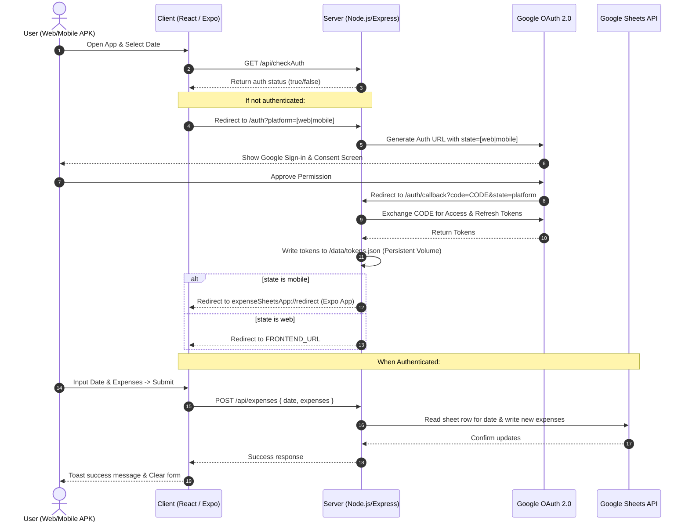

# Expense Sheets 📊

A modern, full-stack Expense Logging Application that records daily expenses directly to a Google Sheet. It features a React (Vite + TypeScript) web client, an Express backend, and supports integration with an Android APK built via Expo using custom URL scheme redirection for Google OAuth.

---

## 🚀 Key Features

* **Daily Expense Tracking**: Log multiple expenses (up to 10 per day) with a name and amount.
* **Smart Sheet Management**: Automatically finds the correct row for a given date, appends new expenses to empty slots, or updates existing entries.
* **Auto-Summing Formula**: Dynamically injects a spreadsheet formula to parse amounts and calculate daily totals automatically without backend computations.
* **Google OAuth 2.0 Auth Flow**: Authenticates users securely via Google OAuth and persists tokens.
* **Multi-Platform Ready**: Seamless authorization flows for both web and mobile clients (redirecting back to Expo mobile apps via deep links).
* **Dockerized & Cloud Deployable**: Ready to deploy on Fly.io with persistent volumes for keeping authentication tokens active.

---

## 🏗️ Architecture & Authentication Flow

Below is the design of the application's authentication and data flow between the clients, server, and Google APIs:



---

## 📋 Google Sheet Structure

The server formats and inserts entries into the Google Sheet named `Sheet1` using the following column mapping:

* **Column A**: `Date` (e.g. `2026-06-29`)
* **Columns B to K (Slots 1–10)**: Daily expenses formatted as `"{name}: {amount}"` (e.g. `Lunch: 15.50`)
* **Column L (Total)**: An Excel/Google Sheets formula dynamically generated and written for new rows:
  ```excel
  =SUMPRODUCT(ARRAYFORMULA(IFERROR(REGEXEXTRACT(B{row}:K{row}, ":\s(\d+\.?\d*)")*1, 0)))
  ```
  *This formula extracts the numerical amount after the colon (`:`) in columns B through K, converts them to numbers, and sums them up automatically.*

---

## ⚙️ Programmatic Setup & Configuration

### Prerequisites

* **Node.js** (v20+) and **npm** installed.
* A **Google Cloud Console** project with the **Google Sheets API** enabled.
* A **Google Sheet** to use as your database.
* **Expo Go** app installed on your physical mobile device (Android or iOS) or an emulator/simulator set up for mobile development.
* **EAS CLI** installed globally if you plan to compile builds: `npm install -g eas-cli`

---

### Step 1: Google Cloud Console Setup

1. Go to the [Google Cloud Console](https://console.cloud.google.com/).
2. Create or select a project.
3. Search for the **Google Sheets API** and click **Enable**.
4. Configure the **OAuth Consent Screen**:
   * Set user type to **External** (or **Internal** if using Google Workspace).
   * Fill out the app information.
   * Add the scope: `https://www.googleapis.com/auth/spreadsheets`.
   * Add your Google account under **Test Users** (crucial if the app is in testing mode).
5. Create **OAuth Credentials**:
   * Navigate to **Credentials** -> **Create Credentials** -> **OAuth client ID**.
   * Select Application Type: **Web application**.
   * Add Authorized Redirect URIs:
     * Local development: `http://localhost:5000/auth/callback`
     * Production: `https://your-backend-app.fly.dev/auth/callback`
   * Click **Create** and note down the **Client ID** and **Client Secret**.

---

### Step 2: Google Sheet Setup

1. Create a new Google Sheet.
2. Ensure the sheet tab is named `Sheet1` (or update server code if renamed).
3. Copy the **Sheet ID** from the sheet's URL:
   `https://docs.google.com/spreadsheets/d/SHEET_ID_HERE/edit`

---

### Step 3: Server Configuration

Navigate into the `server` directory and configure the environment variables:

1. Create a `server/.env` file:
   ```env
   PORT=5000
   FRONTEND_URL=http://localhost:5173
   SHEET_ID=your_google_sheet_id_here
   CLIENT_ID=your_google_oauth_client_id_here
   CLIENT_SECRET=your_google_oauth_client_secret_here
   REDIRECT_URI=http://localhost:5000/auth/callback
   ```
2. *(Optional)* Download the client credentials JSON from Google Cloud Console, rename it to `credentials.json`, and place it in the `server` directory.

---

### Step 4: Web Client Configuration

Navigate into the `client` directory and configure the environment variables:

1. Create a `client/.env` file:
   ```env
   VITE_API_URL=http://localhost:5000
   ```

---

### Step 5: Mobile Client Configuration

Navigate into the `mobile` directory and configure the environment variables:

1. Create a `mobile/.env` file:
   ```env
   API_URL=http://<YOUR_LOCAL_IP>:5000
   ```
   *(Note: For testing on physical mobile devices, use your computer's local IP address e.g. `192.168.1.50` instead of `localhost` or `127.0.0.1`. The mobile device and your computer must be connected to the same Wi-Fi network).*

---

### Step 6: Install & Run Locally

#### Web Application & Backend Server

From the root directory of the project, you can run both the client and server concurrently using:

```bash
# Install dependencies in root, client, and server
npm install
cd client && npm install
cd ../server && npm install
cd ..

# Start both client (Vite) and server (Express) concurrently
npm run dev
```

* The web client will start at: `http://localhost:5173`
* The server will start at: `http://localhost:5000`

#### Mobile Application

Navigate into the `mobile` directory to install dependencies and start the Expo server:

```bash
# Install mobile dependencies
cd mobile && npm install

# Start the Expo development server (Metro bundler)
npm run start
```

* Scan the QR code displayed in the terminal using the **Expo Go** app on your physical mobile device to run it, or press `a` for Android Emulator / `i` for iOS Simulator.

---

## 🐳 Production Deployment (Fly.io example)

The server contains a `Dockerfile` and a `fly.toml` for easy container deployment. Since the Google OAuth refresh token needs to be saved persistently to avoid asking the user to log in repeatedly, a persistent volume is used.

### Fly Volume Setup

The server uses a persistent volume called `tokens_data` mapped to `/data` in the container.

1. Create the volume on Fly.io:
   ```bash
   fly volumes create tokens_data --region bom --size 1
   ```
2. Deploy the application:
   ```bash
   fly deploy
   ```
3. Set your production environment secrets on Fly.io:
   ```bash
   fly secrets set SHEET_ID="your_sheet_id" CLIENT_ID="your_client_id" CLIENT_SECRET="your_client_secret" REDIRECT_URI="https://your-backend-app.fly.dev/auth/callback" FRONTEND_URL="https://your-frontend-app.vercel.app"
   ```

---

## Expo Mobile Integration and Build Guide

To run or compile this project as a mobile application using Expo and maintain proper Google OAuth flows, follow these integration rules:

1. **Custom URL Scheme**: Ensure your Expo configuration ([app.config.js](file:///home/faiz/Faiz/Programming/expense-sheets/mobile/app.config.js)) includes the scheme matching the server's redirect controller config:
   ```javascript
   export default {
     expo: {
       scheme: "expenseSheetsApp",
       // ...
     }
   }
   ```
2. **Authorization Call**:
   * Open the OAuth flow in the mobile application by pointing a browser or web session to:
     `https://your-backend-app.fly.dev/auth?platform=mobile` (or `http://<YOUR_LOCAL_IP>:5000/auth?platform=mobile` locally).
   * This sends the `state` parameter as `mobile`.
3. **Redirection Processing**:
   * Once authorization is approved, the server intercepts the callback, retrieves the tokens, saves them, and performs a redirect to:
     `expenseSheetsApp://redirect`
   * This deep-links back into your Expo React Native application, signaling that the device is successfully authorized and ready to make API calls to `/api/expenses`.

### Compiling Standalone Binaries (EAS Build)

The mobile client is pre-configured with Expo Application Services (EAS) for building apps.

#### 1. Authentication and Project Setup

* **Login to Expo**
  ```bash
  eas login
  ```
  Authenticates your terminal session with the Expo developer portal.

* **Configure EAS Project**
  ```bash
  eas build:configure
  ```
  Initializes and configures the EAS builds for the project.

#### 2. Environment Variables and Secrets for Cloud Builds

* **Create Environment Secret**
  ```bash
  eas secret:create --name API_URL --value https://expense-google-sheets.fly.dev
  ```
  Creates a secure environment secret on EAS servers. Since app.config.js references `process.env.API_URL`, this secret will automatically inject the production backend URL into the client bundle at build-time.

* **Manage Environment Variables**
  ```bash
  eas env:create
  eas env:list
  ```
  Allows creating and listing environment variables for cloud builds via the CLI.

#### 3. Build Commands

* **Build Android Development Client**
  ```bash
  eas build --platform android --profile development
  ```
  Builds a custom development client containing the `expo-dev-client` library for native testing.

* **Build Android Production App**
  ```bash
  eas build -p android --profile production
  ```
  Compiles the production-ready distribution binary (.aab) for the Google Play Store.

* **Build Android Production APK**
  ```bash
  eas build -p android --profile production-apk
  # or: eas build --profile production-apk --platform android
  ```
  Builds a standalone installable `.apk` using production configuration for direct installation and testing on devices.

For more details on the mobile app, see the [mobile/README.md](file:///home/faiz/Faiz/Programming/expense-sheets/mobile/README.md).
